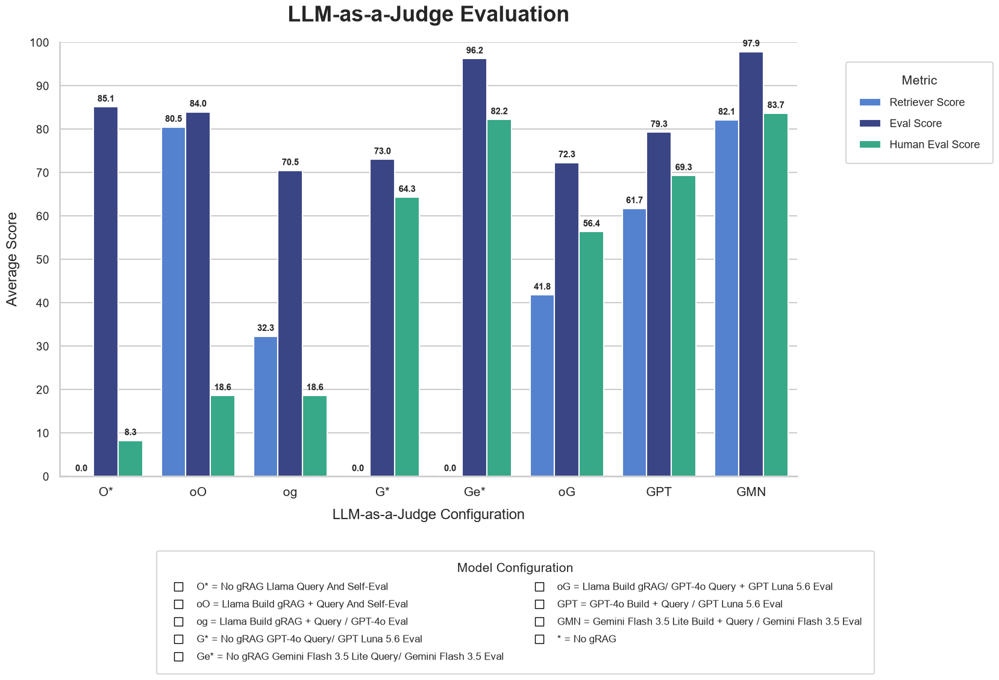
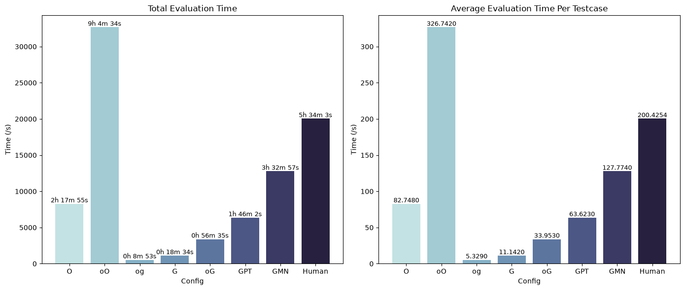
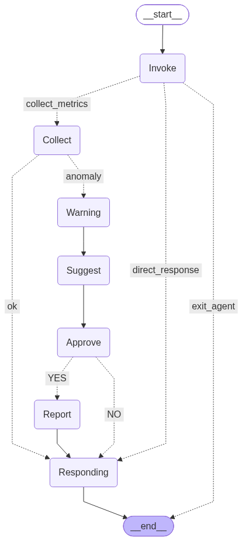

# gRAG AI Agent For Load Balancing Problem With NGINX

**DevOps AI assistant powered by LangChain and LLM using gRAG.**

> I'm looking for 3-months internship this Oct 2026, please contact me via `2351050045hiep@ou.edu.vn` or `khangha2406@gmail.com` for job offer. Best regards

[](https://www.python.org/downloads/)
[](https://www.langchain.com/)
[](https://python.langchain.com/docs/langgraph)
[](https://neo4j.com/)
[](https://prometheus.io/)
[](https://www.docker.com/)
[]()
[]()

The result was gathered by testing 100 case using LaaJ and Manual Evaluation.

## 

## Overview

**Graph RAG for Load Balancing** is an AI agent designed to simplify reverse-proxy and traffic-management tasks. By combining **Graph-based Retrieval-Augmented Generation (Graph RAG)** via **Neo4j** with real-time telemetry from **Prometheus**, the agent reasons about network topology, backend service health, and current traffic bottlenecks.

When an issue or user query arises, the agent:

1. Fetch live performance metrics from **Prometheus**.
2. Queries the **Neo4j Knowledge Graph** to map dependencies, service endpoints, and historical configs.
3. Generates suggested **Nginx load-balancing configurations** with clear explanations.
4. Posts proactive warnings, incident reports, and config suggestions directly to **Slack**.

.png>)

_<u>Quick note from me:</u> This is the implement for my Graduate Project defending, if my report pass the Turnitin, I really hope that won't kill me. I work 8-12 hours/day on this project for 6 weeks. I've even had corneal ulcer, and it still hurts until these lines were typed because one of the evaluation made by me with 600+ test. It was full of PAIN, but then my guilding teacher said I'm using project from Github 🙂... I'm speachless, I don't know what to say. I've been thinking about this from last night. What a huge disappointment. If I was judged to be plagiarizing, I will drop out for all my own work throw out because of a checker software_

_For your trust. This is one of the run-time recorded each evaluation. My eyes still hurt when I see this._



_So if you don't see me commit the memory part to GitHub after 27 Sept 2026, I somewhat fail the plagiarism round and this is the last thing I would touch in this industry. Then I quitted the collage and became a poor farmer, living miserablely and lonely with the blame from my family._

_Otherwise, all my code bros, wish me luck. I will need that for GP and this year internship._ 😔

---

## ✨ Key Features

- 🕸️ **Graph-Aware Context (Graph RAG):** Models services, upstream servers, network routes, and SLAs in Neo4j to provide rich context to the LLM.
- 📊 **Real-time Prometheus Integration:** Automatically pulls real-time metric data (CPU, memory, network connections, latency) to assess load conditions.
- ⚡ **Stateful Workflows with LangGraph:** Uses a deterministic, loopable state graph to route tasks, validate proposed configs, and retry on failure.
- 🛠️ **Automated Nginx Config Generation:** Produces syntactically valid `nginx.conf` upstream blocks, weighted routing rules, and rate-limiting directives.
- 💬 **Slack Integration:** Delivers rich formatting with warning flags, actionable reports, and configuration explanations to operational channels.

---

## Structure of this project

Dataset source: [Kaggle](https://www.kaggle.com/datasets/sandhyapeesara/cloud-anomaly-data)

It will be found in `data/datasets`.

Data will be processing in: [dataset.ipynb](./dataset.ipynb)

`./grag `: This for pre-stage for gRAG query including extracting Entry+Relationship and Building communities. Using the knowledge data from `data/data.md`. The knowledge data will be collect from [blog](https://www.getpagespeed.com/server-setup/nginx/nginx-load-balancing) with converted to .md and remove all the links.

If you don't wanna do this a gain, follow below instruction for using .dump file to neo4j db in `.neo4j_backups`

Agent can be found in `agent.py` which can be used in client-server model which intergrated agent inside FastAPI server in `main.py` and frontend with NextJS in `./frontend`. Detail to run in bellow section.

Evaluation will use LaaJ and devided in 2 type: Pure eval(vanilla eval) in `vanila_eval.py` and gRAG eval in `eval.py`. It have `CHECKPOINT` const for cont from previous so check before run.

Later can be manual judge by yourself in `eval.ipynb`, using VSCode with extensions for Jupiter and install its kernel will save you lots of time cuz it very handy, just click run all bellow the print output to read and type in the top bar to score.

## System Architecture

Agent workflow including Proemtheus server to colelct metrics and nginx.conf to intergrate with. Agent recieved the input from user then decided which action to do. Agent can exit the loop, normal query, query with gRAG using `/grag:` and ask about inner system.

1. System recieves INPUT which is resource usage metrics are retrieved and formatted into a JSON structure as follows:

```json
[
    // Server 1
    {
        "IP or server name": "",
        "CPU usage": ,
        "RAM usage": ,
        "Connection count": ,
    },
    // Server 2 (similar format)...
]
```

The dataset must include at least two servers, as a single server does not require load balancing. While additional parameters—such as `latency` or response time—could be included, the metrics listed above (RAM, CPU, and connection count) are sufficient to define the load profile and determine the appropriate load balancing strategy, as Nginx load balancing methods rely on these specific factors.
This project does not evaluate other hardware components, such as external storage.
Percentage (%) is selected as the unit for CPU and RAM usage because it is standardized and easy to interpret. For instance, setting percentage-based thresholds for alerts is more practical than measuring absolute resource units, given that hardware variations mean a specific usage level might represent a high load on one machine but not on another. Furthermore, when administrators review the generated configuration, interpreting percentage figures is more intuitive than analyzing "current usage vs. total capacity" ratios.
JSON is used for the input format because it offers superior data structuring; the `{}` syntax allows for clear separation between servers, enabling the model to recognize the data as a list of servers.

2. Input data triggers alerts when CPU or RAM usage exceeds 60% (moderate alert level) or 80% (high alert level).

CPU and RAM were selected because they are the system's primary server resources.

3. Regarding the alert configuration, thresholds of 60% and 80% were selected. A 60% level is common during stable or light usage, and occasional spikes above this mark are normal; therefore, a moderate setting is appropriate here, while also considering the duration of the spike and whether it escalates further. Consequently, the critical alert level is set at 80%. The 80% threshold was chosen because it indicates high resource utilization while leaving a 20% margin before reaching the limit, thereby providing administrators with sufficient time to respond.

4. If use with `/pro:`, it will go collect the metrics from `PROMETHEUS_URL` in `config.py`, if normal, it return, other than that, it will send message to Slack using `Slack-websocket` then run suggestion with gRAG and give the explaination and Nginx config recommendation and ask for approve. If user approve, it send message throgh Slack and change the config file.

If the user agrees to the update, the agent will replace the existing `upstream` block in the configuration with the newly generated output. This is because Nginx load balancing configurations are defined within an `upstream {}` block in the `nginx.conf` file; the proposed configuration applies specifically to this block. This is because the usage of Nginx LB method. You better have a good knowledge of this tech before using this [guild](https://docs.nginx.com/nginx/admin-guide/load-balancer/http-load-balancer/#proxy_pass)



The Suggest node and might be Invoke use the gRAG with structure like this:


This is a FYP, what are you expected from the dumbest student in whole department 😔

## Prerequisites

- [Docker Engine](https://www.docker.com/get-started/) and [Docker Compose](https://docs.docker.com/compose/) installed.
- Python 3.14+ installed.
- An OpenAI API Key (or alternative LLM configuration or installed Ollama model).
- A Slack Incoming Webhook URL.

---

## Environment Setup

1. Clone the repository and setup a virtual environment, then install FULL all of stuff required to Python:

```bash
python -m venv venv
source venv/bin/activate  # On Windows: venv\Scripts\activate
pip install -r requirements.txt

```

BUT if you just need to run AI Agent or deploy it, just run the shorter in `deployment/requirements.txt` for much lighter Docker image.

2. Create a `.env` file like the examle in the root directory:

3. Setup the parameter in the `config.py`:

---

### KNOWLEDGE GRAPH SETUP

1. If u just what to run agent

Base on what you run Neo4j, you need to load the .dump file in db:

- If you use cloud ver: https://neo4j.com/docs/desktop/current/operations/database-management/#_load_a_database
- If you use Docker: https://neo4j.com/docs/operations-manual/current/docker/dump-load/

use this in .env:

```dotenv
# NEO4J_URI=bolt://localhost:7687
# NEO4J_URL=http://localhost:7474/browser/
# NEO4J_USERNAME=neo4j
# NEO4J_PASSWORD=password
```

then access `http://localhost:7474` using username `neo4j` and your configured `password`.

```bash
docker-compose -f ./neo4j.yaml up -d

```

2. If you want to build everything from scratch, run these stuff ONE BY ONE:

```python
python -m gRAG.extractor
py -m gRAG.community_builder --build
```

---

### AGENT SETUP

I got 3 option to run this base on your need

#### 1. The demo version

This is the ver I'm going to use for my defending round.


To have a metrics api, I created a prometheus server with 2 exporter using Docker. Also with a polinux/stress to make the system overload. It can be start with

```bash
docker-compse up
```

Next, execute the main interactive CLI:

```bash
python agent.py

```

.png>)

#### 2. The web version

This version work with a client-server model, so it require a DB to connect. I used PostgreSQL on Neon provider.

Backend:

```bash
fastapi run
```

Frontend:

```bash
cd frontend
npm run dev
```

Then access http://localhost:3000 for the app. U can basically use 2. exactly like 1. The main different is that the 2. give you a better UX/UI


#### 3. The deployment (NOT RECOMMENDED)

Execpt eval files and .ipynb, copy all py file to `./deployment` it will be use to build docker image.

To deploy this, you better have an infrastructure for a true system. This include agent must putting INSIDE the system that somehow it can access to the `nginx.conf`
Other than that, the Prometheus server also a must. That mean you have to have a quite decent system in term of scale.

My choice? I used this as a chatbot instead of the agent.

### Final word


This agent don't have memory, but I think you will find a way to make it. Good luck and happy coding!!
